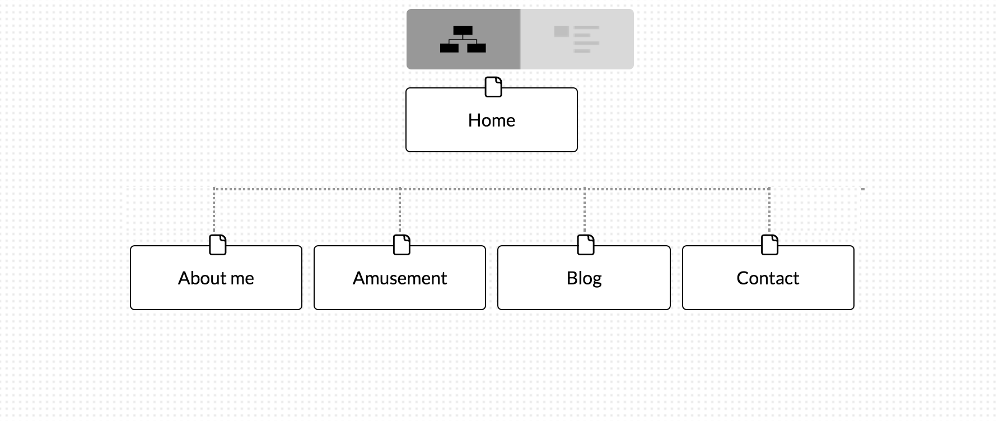

1. What are the 6 Phases of Web

Information gathering, planning, design, development, testing and delivery, and

maintenance.

2. What is your site's primary goal or purpose? What kind of content will your site feature?

To introduce myself to the internet. It will feature basic information about myself and a blog on my

development experience.

3. What is your target audience's interests and how do you see your site addressing

them?

MY target audiences interests are web development, and I plan to address them in a

lighthearted and carefree manner, interjecting comedy where I can.

4. What is the primary "action" the user should take when coming to your site? Do you

want them to search for information, contact you, or see your portfolio? It's ok to have

several actions at once, or different actions for different kinds of visitors.

Follow me on social media, i.e. twitter.

5. What are the main things someone should know about design and user experience?

It is extremely important. How people feel when using your website will determine in large part whether

they come back. It doesn’t matter how you feel about your website, it matters how others perceive it. That

is, if you want it to be successful.

6. What is user experience design and why is it valuable? 

It is how people feel when interacting with your website. It is valuable because websites with

superior UX are the ones that stand out. IF you have a frustrating UX then people will not want to

interact with your site and your site will not be successful.

7. Which parts of the challenge did you find tedious?

It wasn’t tedious but it was extremely frustrating trying to get my site map to appear in the

document. I couldn’t do it for awhile, it seems very simple, but for some reason it wouldn’t

work.

