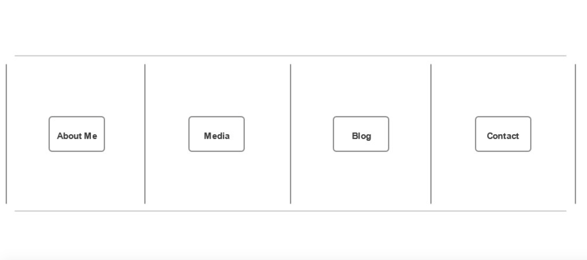
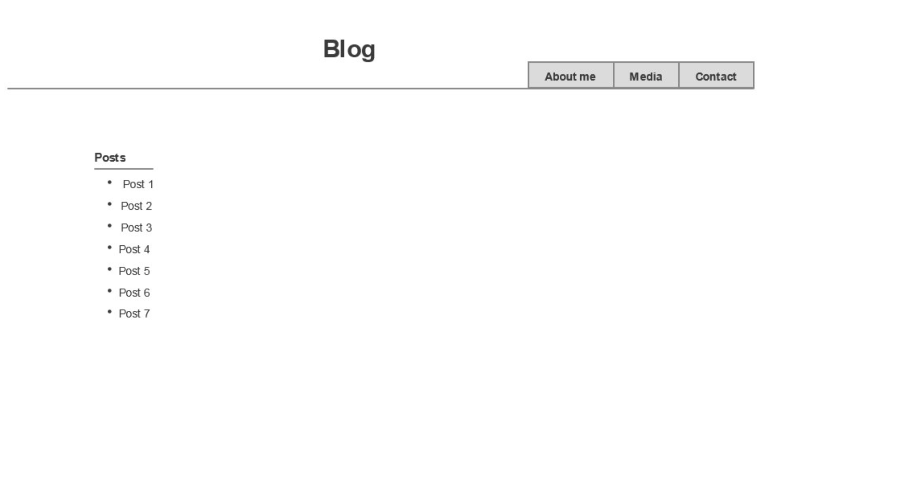

1) What is a wireframe?

An outline of what your site will look like design wise. It should include the elements you need so you

can effectively plan the structure of your html.

2) What are the benefits of wireframing?

It allows you to plan for what you want your site to look like. It’s easier to have a picture in mind when

you start writing your code as opposed to figuring it out while you are writing your code.

3) Did you enjoy wireframing your site?

I did. At first it was frustrating because I was trying to remember what a site “should” look like, but

then I realize I could just do whatever I wanted to do, and it felt good being able to express myself.

4) Did you revise your wireframe or stick with your first idea?

I revised it a little bit.

5) What questions did you ask during this challenge? What resources did you find to help you

answer them?

It seemed pretty self explanatory since we just needed to draw out what the site would look like, but I

did do some basic research into some example wire frames.

6) Which parts of the challenge did you enjoy and which parts did you find tedious?

I enjoyed wire framing the site. Saving everything to github etc has become a little tedious though.

But fortunately it is a very small portion of what we do.

