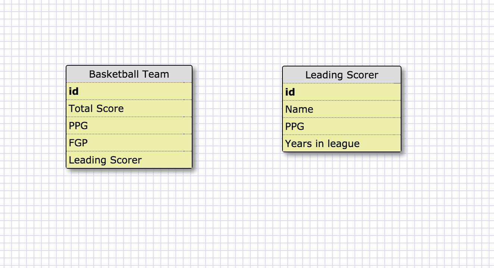
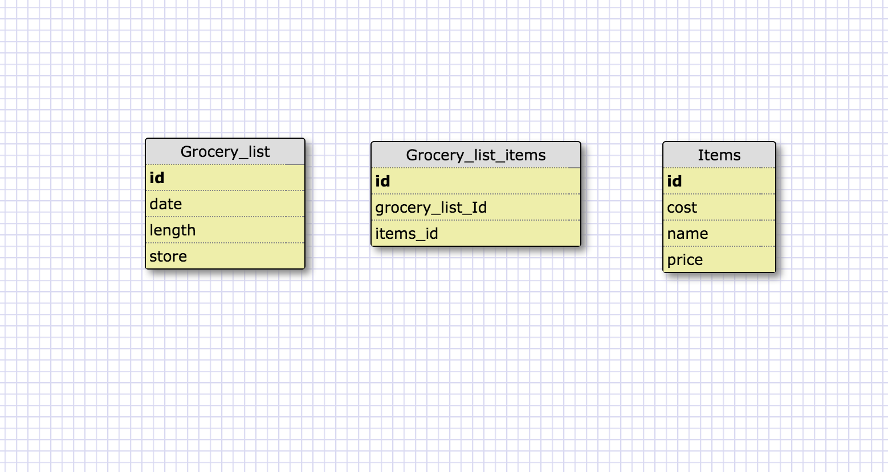

What is a one-to-one database? one to one is when you have a relationship between two items where one thing can only have one of the other, such as a state can only have one capital
When would you use a one-to-one database? (Think generally, not in terms of the example you created). You would use it when you want to associate two items, and one can only have one of the other
What is a many-to-many database? When you associate two things and each one can have multiple things of the other
When would you use a many-to-many database? (Think generally, not in terms of the example you created). When you have a situation where you want to associate things where many can be associated with many
What is confusing about database schemas? What makes sense? Many to many is sort of confusing, but I understand one to one